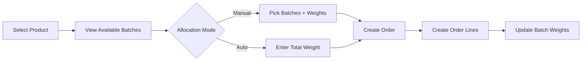
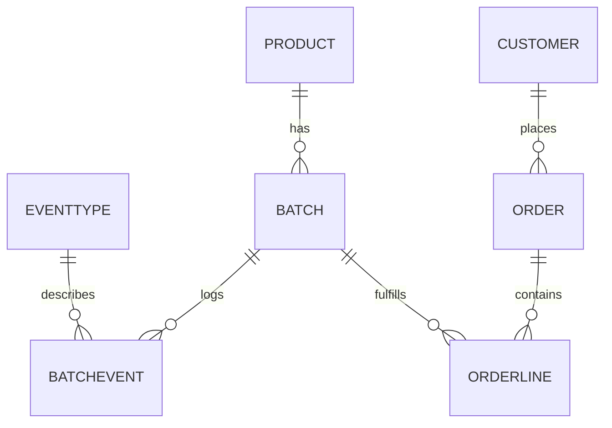
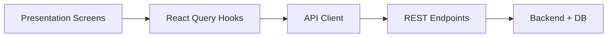

# Evaspoika Frontend
Warehouse Dashboard and Order Allocation

---

**Project Snapshot**
- Mobile-first warehouse dashboard built with Expo and React Native.
- Manages products, batches, batch events, orders, and customers.
- Emphasizes batch-level inventory accuracy and traceability.

---

**Key Capabilities**
- Product catalog with price per kg and optional EAN.
- Batch tracking with current weight and production details.
- Batch events to record weight changes over time.
- Order creation with automatic or manual batch allocation.
- Customer directory for order context.

---

**Order Creation Flow**


---

**Allocation Modes**
Manual allocation
- Choose specific batches.
- Enter sold weight per batch.
- Validates against batch availability.

Automatic allocation
- Enter total order weight.
- Allocates across batches by production date.
- Ensures inventory is sufficient.

---

**Inventory Traceability**
- Batches are linked to products and have current weight.
- Batch events store event type, date, and weight change.
- Event types provide human-readable labels for each change.

---

**Data Model (Simplified)**


---

**Architecture Overview**


---

**Code Structure**
```
src/
  features/
    products/
    batches/
    batchEvents/
    orders/
    orderLines/
    customers/
  infrastructure/
    api/
  providers/
  shared/
```

---

**Routes and Screens**
- `/` Home dashboard
- `/products` Product list and create
- `/batches` Product selection for batches
- `/batches/:productId` Batch list for a product
- `/batch-events` Batch event list
- `/batch-events/:batchId` Batch event list for a batch
- `/orders` Order creation and allocation
- `/customers` Customer list

---

**Tech Stack**
- Expo + React Native (mobile and web)
- Expo Router for file-based navigation
- React Query for data fetching and caching
- TypeScript for type safety

---

**Configuration**
- API base URL from `EXPO_PUBLIC_API_BASE_URL`.
- Fallback to Expo config `extra.apiBaseUrl`.
- Local default: `http://localhost:3000/api`.

